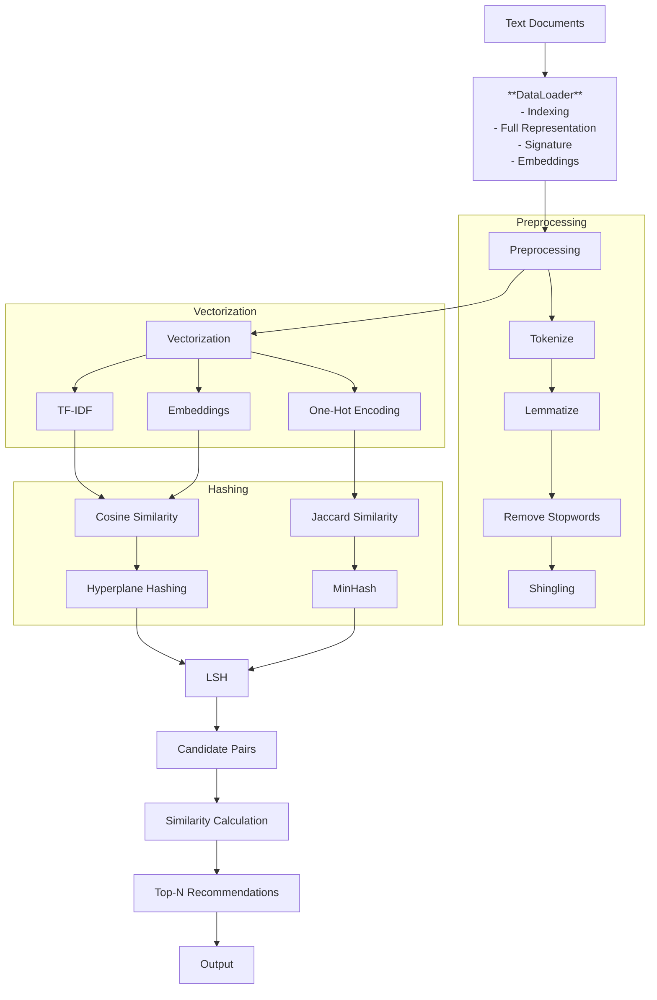

# Locality Sensitive Hashing Recommendation System

[](LICENSE)
[](https://www.python.org/downloads/)
[](pyproject.toml)
[](https://github.com/mxngjxa/lshrs/actions/workflows/lint.yml)
[](https://github.com/mxngjxa/lshrs/deployments)
[](https://github.com/astral-sh/ruff)
[](https://pypi.org/project/lshrs/)
[](https://GitHub.com/mxngjxa/lshrs/graphs/contributors/)
[](https://GitHub.com/mxngjxa/lshrs/graphs/commit-activity)

A Locality Sensitive Hashing (LSH) based recommendation system for efficient similarity search in Python.

## Table of Contents

- [Project Structure](#project-structure)
- [Installation](#installation)
- [Usage](#usage)
- [Architecture](#architecture)
- [License](#license)
- [Authors](#authors)
- [Changelog](#changelog)
- [Contributing](#contributing)

## Project Structure

The project is organized as follows:

```
.
├── CHANGELOG.md
├── docs
│   ├── api
│   ├── architecture.md
│   ├── examples
│   ├── index.md
│   ├── project_structure.txt
│   └── quickstart.md
├── examples
│   ├── advanced_usage.py
│   └── basic_usage.py
├── LICENSE
├── pyproject.toml
├── README.md
├── src
│   └── lshrs
│       ├── core
│       ├── encoding
│       ├── hashing
│       ├── preprocessing
│       └── utils
└── tests
    ├── fixtures
    ├── integration
    └── unit
```

- **docs**: Contains project documentation.
- **examples**: Contains example scripts for using the library.
- **src/lshrs**: Contains the source code for the `lshrs` library.
- **tests**: Contains unit and integration tests.

## Installation

To install the required dependencies, run the following command:

```bash
pip install -r requirements.txt
```

The dependencies are:
- `scipy`
- `scikit-learn`
- `numpy`
- `nltk`

## Usage

You can find basic and advanced usage examples in the `examples` directory.

- [`basic_usage.py`](examples/basic_usage.py:1)
- [`advanced_usage.py`](examples/advanced_usage.py:1)

## Architecture

The following diagram illustrates the architecture of the LSH recommendation system:



## Core Orchestration of the `lshrs` Library

This directory contains the source code for the `lshrs` library, a Python-based recommendation system using Locality Sensitive Hashing (LSH).

### Modules

The `lshrs` library is organized into the following modules:

- [Core](#core)
- [Encoding](#encoding)
- [Hashing](#hashing)
- [Preprocessing](#preprocessing)
- [Utils](#utils)

---

#### Core

The `core` module contains the main components for running the LSH recommendation system.

- **`config.py`**: Defines configuration settings for the application.
- **`dataloader.py`**: Handles loading and preparing data for the LSH process.
- **`exceptions.py`**: Defines custom exception classes for error handling.
- **`interfaces.py`**: Contains interface definitions for different components.
- **`main.py`**: The main entry point for running the LSH recommendation system.

---

#### Encoding

The `encoding` module provides different methods for vectorizing text data.

- **`embedding.py`**: Implements word embedding techniques.
- **`main.py`**: Main script for handling encoding processes.
- **`onehot.py`**: Implements one-hot encoding.
- **`tfidf.py`**: Implements TF-IDF (Term Frequency-Inverse Document Frequency) vectorization.

---

#### Hashing

The `hashing` module contains different hashing algorithms used in LSH.

- **`hyperplane.py`**: Implements hyperplane-based hashing for cosine similarity.
- **`lsh.py`**: The main LSH implementation that combines hashing and candidate selection.
- **`minhash.py`**: Implements MinHash for Jaccard similarity.

---

#### Preprocessing

The `preprocessing` module provides tools for cleaning and preparing text data.

- **`lemmatize.py`**: Implements lemmatization to reduce words to their base form.
- **`shingling.py`**: Implements shingling to create k-shingles from text.
- **`stopwords.py`**: Provides functionality for removing stopwords.
- **`website.py`**: Contains functions for preprocessing website content.

---

#### Utils

The `utils` module contains helper functions and utilities used across the library.

- **`br.py`**: Implements the band-and-row (BR) technique for LSH.
- **`helpers.py`**: Contains general helper functions.
- **`save.py`**: Provides functionality for saving and loading data.
- **`similarity.py`**: Contains functions for calculating similarity between vectors.

---

## License

This project is licensed under the MIT License. See the [`LICENSE`](LICENSE:1) file for details.

## Authors

- Y. Zhao ([yimingzhao936@gmail.com](mailto:yimingzhao936@gmail.com))
- M. Guan ([mingjia.guan@outlook.com](mailto:mingjia.guan@outlook.com))

## Changelog

See the [`CHANGELOG.md`](CHANGELOG.md:1) file for a history of changes to the project.

## Contributing

Contributions are welcome! Please see the [`.pre-commit-config.yaml`](.pre-commit-config.yaml:1) for linting and formatting guidelines.