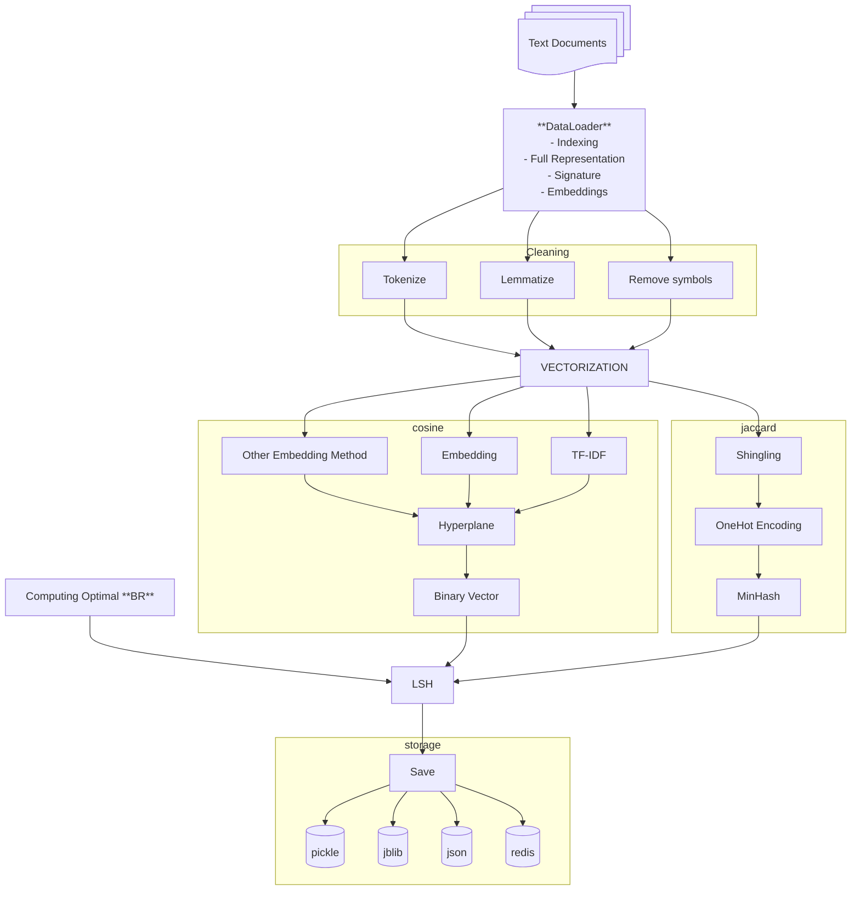

```mermaid
---
config:
  layout: dagre
---
flowchart TD

    A["Text Documents"]
    A --> B["**DataLoader**
    - Indexing
    - Full Representation
    - Signature
    - Embeddings"]

    B --> C & D & E


    subgraph Cleaning
    C["Tokenize"]
    D["Lemmatize"]
    E["Remove symbols"]
    end

        C --> F["VECTORIZATION"]


    D --> F
    E --> F


    F --> G1 & G2 & G3 & G4

    G1["Shingling"]

    subgraph cosine
      G2["TF-IDF"]
      G4["Embedding"]
      G3["Other Embedding Method"]
      G3 --> H2["Hyperplane"]
      G4 --> H2
          G2 --> H2

    H2 --> K2["Binary Vector"]

    end

    subgraph jaccard
    G1 --> I1["OneHot Encoding"]
    I1 --> I2["MinHash"]
    end

    N["Computing Optimal **BR**"] --> K1["LSH"]

    K2 --> K1
    I2 --> K1


    K1 --> L1["Save"]

    subgraph storage
    L1 --> M1 & M2 & M3 & M4
    end
    
    M1[("pickle")]
    M2[("jblib")]
    M3[("json")]
    M4[("redis")]
    


    A@{ shape: docs}
```

References:
Scikit-learn for tf-idf