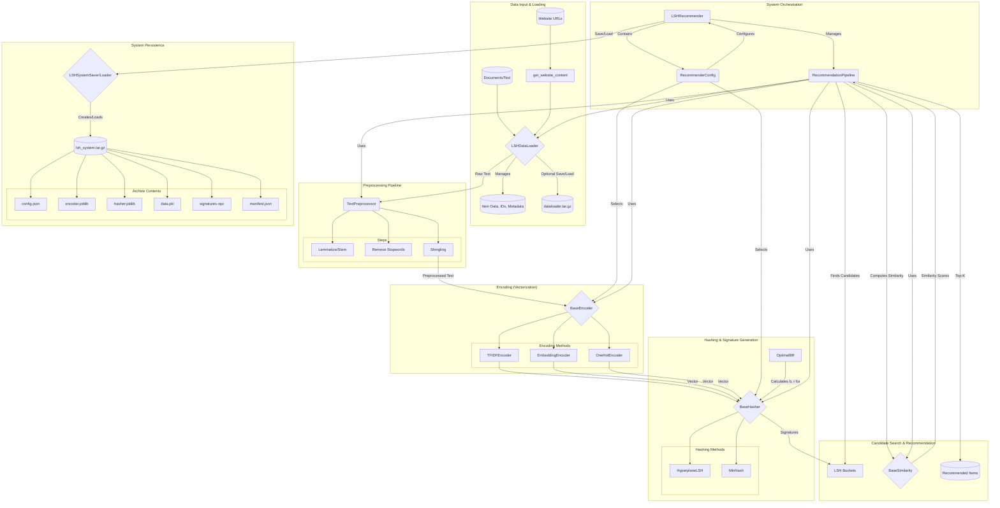

```mermaid
---
config:
  layout: dagre
---

graph TD
    subgraph "System Orchestration"
        direction LR
        A[LSHRecommender] -- Manages --> B(RecommendationPipeline)
        C(RecommenderConfig) -- Configures --> A
    end

    subgraph "Data Input & Loading"
        direction TB
        D[("Documents/Text")] --> E{LSHDataLoader}
        F[("Website URLs")] --> G[get_website_content] --> E
        E -- Manages --> H[(Item Data, IDs, Metadata)]
        E -- Optional Save/Load --> I[("dataloader.tar.gz")]
    end

    subgraph "Preprocessing Pipeline"
        direction TB
        J(TextPreprocessor)
        E -- Raw Text --> J
        subgraph "Steps"
            direction LR
            J1[Lemmatize/Stem]
            J2[Remove Stopwords]
            J3[Shingling]
        end
        J --> J1 & J2 & J3
    end

    subgraph "Encoding (Vectorization)"
        direction TB
        K{BaseEncoder}
        J3 -- Preprocessed Text --> K
        C -- Selects --> K
        subgraph "Encoding Methods"
            direction LR
            K1[TFIDFEncoder]
            K2[EmbeddingEncoder]
            K3[OneHotEncoder]
        end
        K --> K1 & K2 & K3
    end

    subgraph "Hashing & Signature Generation"
        direction TB
        L{BaseHasher}
        K1 -- Vector --> L
        K2 -- Vector --> L
        K3 -- Vector --> L
        C -- Selects --> L
        subgraph "Hashing Methods"
            direction LR
            L1[HyperplaneLSH]
            L2[MinHash]
        end
        L --> L1 & L2
        L3[OptimalBR] -- Calculates b, r for --> L
    end

    subgraph "Candidate Search & Recommendation"
        direction TB
        M[LSH Buckets]
        L -- Signatures --> M
        B -- Finds Candidates --> M
        N{BaseSimilarity}
        B -- Computes Similarity --> N
        N -- Similarity Scores --> B
        B -- Top-K --> O[("Recommended Items")]
    end

    subgraph "System Persistence"
        direction TB
        P{LSHSystemSaver/Loader}
        A -- Save/Load --> P
        P -- Creates/Loads --> Q[("lsh_system.tar.gz")]
        subgraph "Archive Contents"
            direction LR
            Q1[config.json]
            Q2[encoder.joblib]
            Q3[hasher.joblib]
            Q4[data.pkl]
            Q5[signatures.npz]
            Q6[manifest.json]
        end
        Q --> Q1 & Q2 & Q3 & Q4 & Q5 & Q6
    end

    A -- Contains --> C
    B -- Uses --> E
    B -- Uses --> J
    B -- Uses --> K
    B -- Uses --> L
    B -- Uses --> N
```