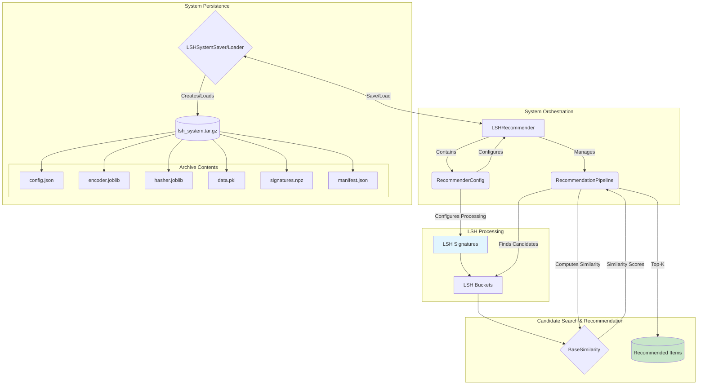
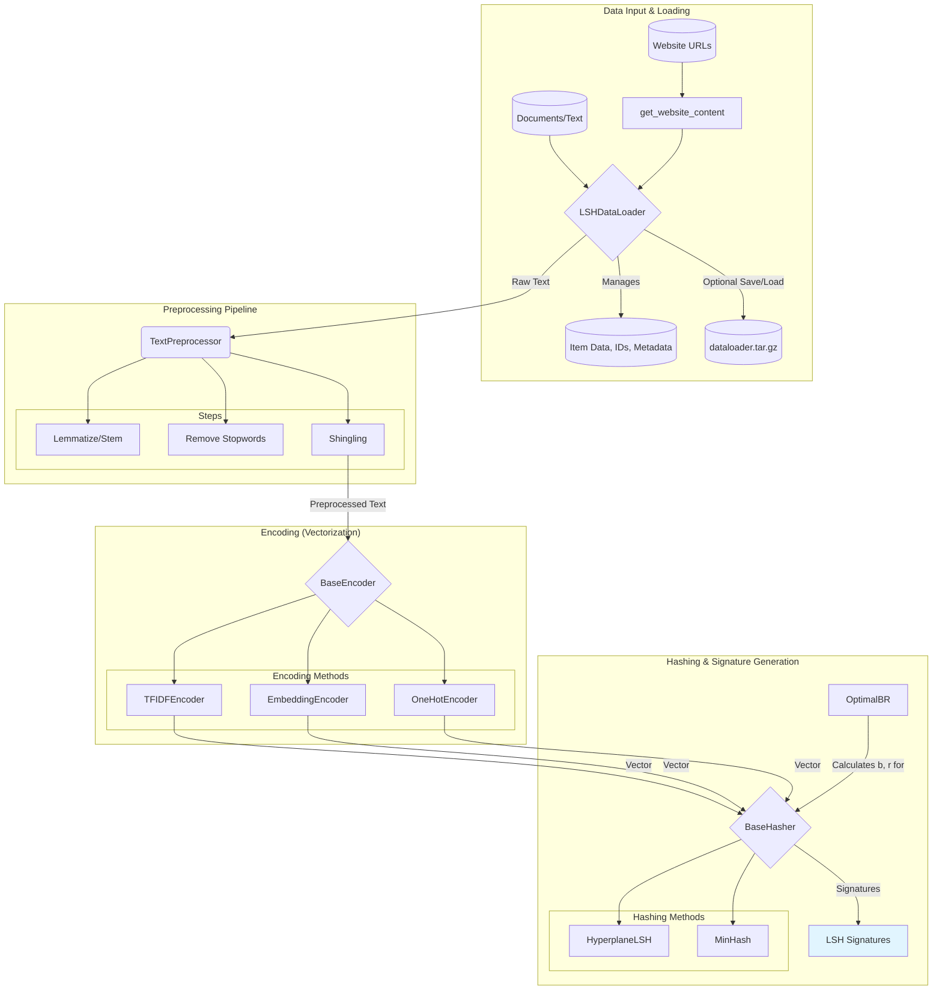

# Architecture Diagram for LSH Recommender System

## LSH System & Recommendation Engine




```{mermaid}
---
config:
  layout: dagre
---
flowchart TD

    A@{ shape: docs, label: "Text documents" }

    A --> B["**DataLoader**
    - Indexing
    - Full Representation
    - Signature
    - Embeddings"]

    B --> C["Preprocessing"]

    subgraph Preprocessing
        direction LR
        C --> D["Tokenize"]
        C --> E["Lemmatize"]
        C --> F["Remove Stopwords"]
        C --> G["Shingling"]
    end

    D & E & F & G --> H["Vectorization"]

    subgraph Vectorization
        direction LR
        H --> I["TF-IDF"]
        H --> J["One-Hot Encoding"]
        H --> K["Embeddings"]
    end

    I --> L["Cosine Similarity"]
    J --> M["Jaccard Similarity"]
    K --> L

    subgraph Hashing
        direction LR
        L --> N["Hyperplane Hashing"]
        M --> O["MinHash"]
        N & O --> P["LSH"]
    end

    P --> Q["Candidate Pairs"]
    Q --> R["Similarity Calculation"]
    R --> S["Top-N Recommendations"]

    S --> T["Output"]
```

## Data Processing Pipeline

