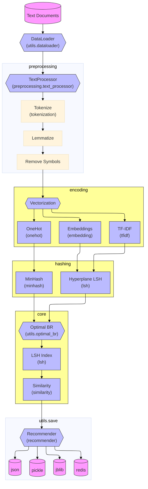

```mermaid
---
config:
  layout: elk
  theme: base
---
flowchart TD

    A[("Text Documents")] --> B{{"DataLoader\n(utils.dataloader)"}}

    B --> C{{"TextProcessor\n(preprocessing.text_processor)"}}

    subgraph Preprocessing[preprocessing]
        direction TB
        C --> C1["Tokenize\n(tokenization)"]
        C1 --> C2["Lemmatize"]
        C2 --> C3["Remove Symbols"]
    end

    C3 --> D{{"Vectorization"}}

    subgraph Encoding[encoding]
        direction LR
        D --> E1["TF-IDF\n(tfidf)"]
        D --> E2["Embeddings\n(embedding)"]
        D --> E3["OneHot\n(onehot)"]
    end

    subgraph Hashing[hashing]
        direction TB
        E1 & E2 --> F1["Hyperplane LSH\n(lsh)"]
        E3 --> F2["MinHash\n(minhash)"]
    end

    F1 & F2 --> G{{"Optimal BR\n(utils.optimal_br)"}}
    
    subgraph Core[core]
        direction RL
        G --> H1["LSH Index\n(lsh)"]
        H1 --> H2["Similarity\n(similarity)"]
    end

    H2 --> I{{"Recommender\n(recommender)"}}

    subgraph Persistence[utils.save]
        direction TB
        I --> J1[("pickle")]
        I --> J2[("jblib")]
        I --> J3[("json")]
        I --> J4[("redis")]
    end

    classDef data fill:#f9f,stroke:#333
    classDef process fill:#bbf,stroke:#333
    classDef interface fill:#ff9,stroke:#333
    class A,J1,J2,J3,J4 data
    class B,C,D,E1,E2,E3,F1,F2,G,H1,H2,I process
    class Core,Encoding,Hashing interface

    click B "https://github.com/yourrepo/lshrs/blob/main/src/lshrs/utils/dataloader.py" "DataLoader source"
    click C "https://github.com/yourrepo/lshrs/blob/main/src/lshrs/preprocessing/text_processor.py" "TextProcessor source"
```